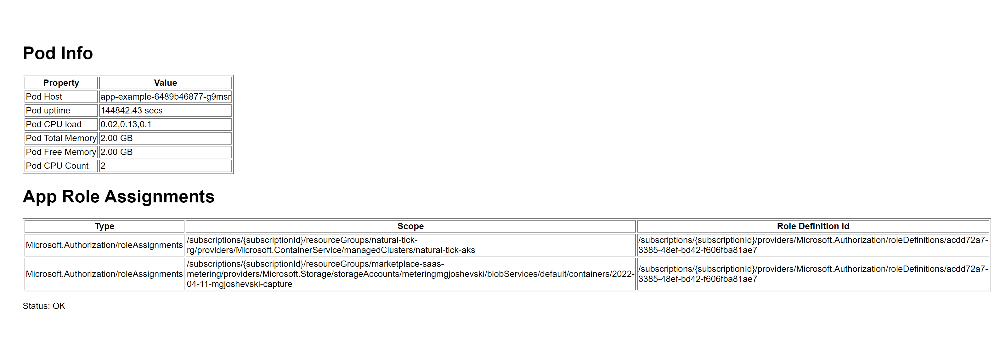
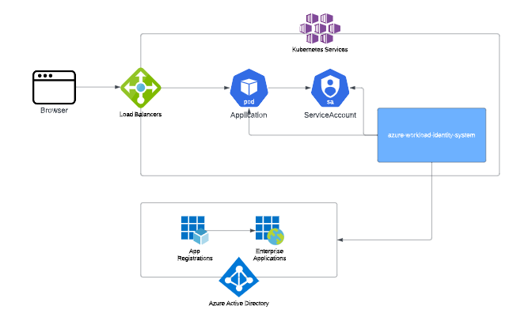
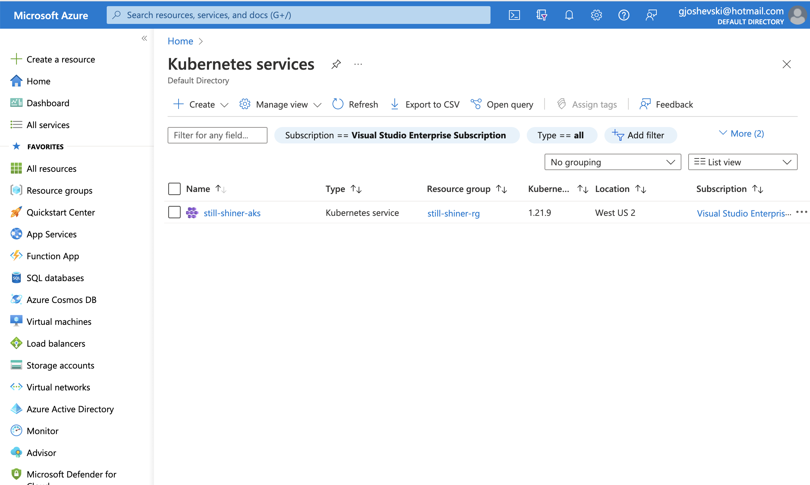
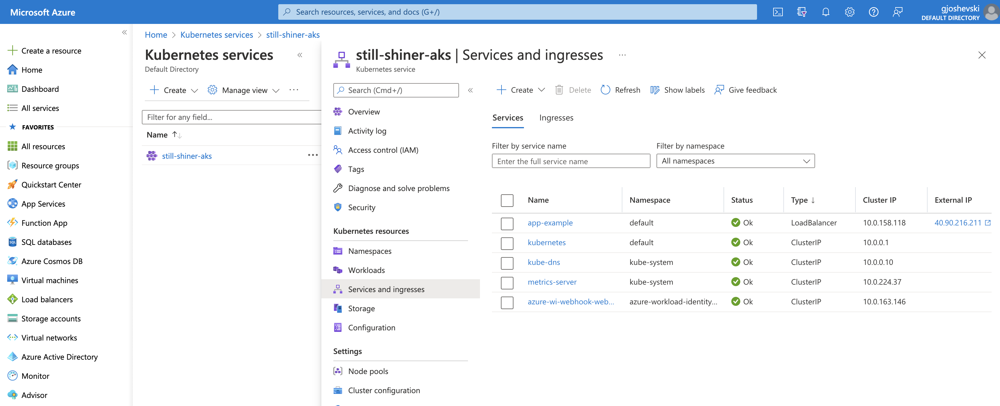
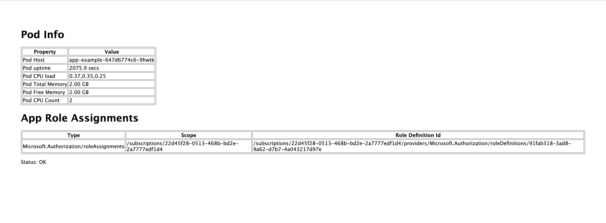
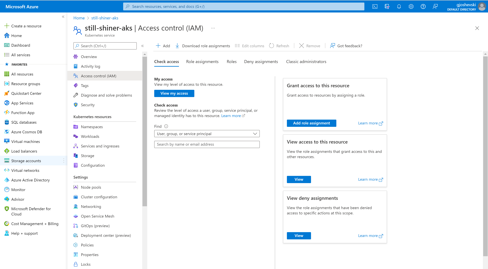
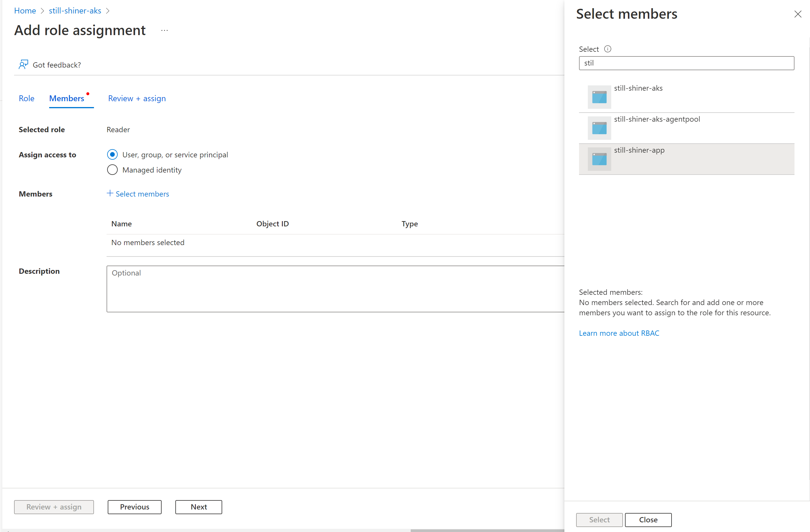
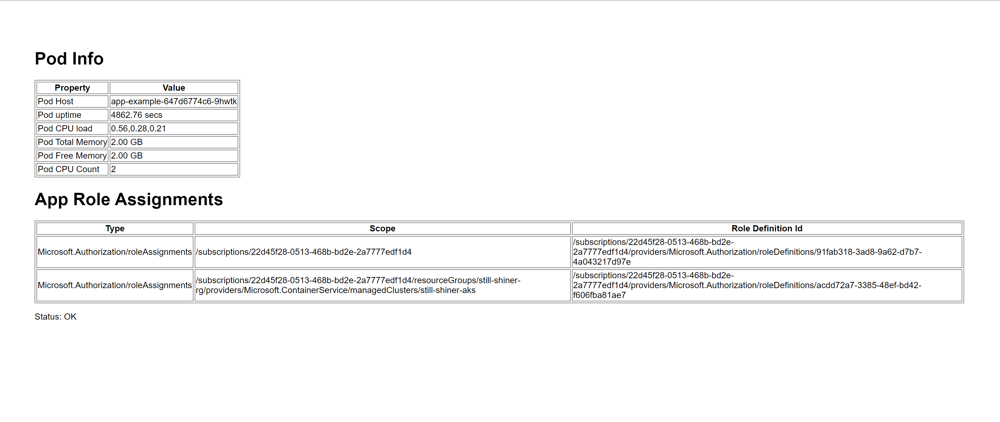
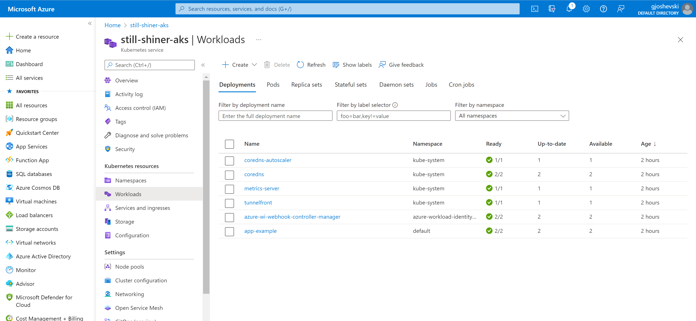
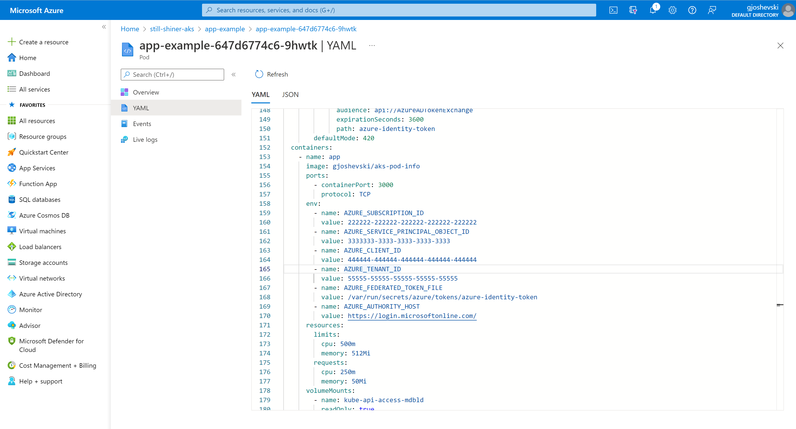

# Use Azure AD workload identity to securely access Azure services or resource from your Kubernetes cluster - Example using Node.js application, AKS and Terraform

A common challenge architects and developers face when designing a Kubernetes solution is how to grant containerized workload permissions to access an Azure service or resource.

To avoid the need for developers to manage credentials, recommended way is to use Managed identities.

[Managed identities](https://docs.microsoft.com/en-gb/azure/active-directory/managed-identities-azure-resources/overview
) provide an identity for applications to use when connecting to resources that support Azure Active Directory (Azure AD) authentication. Applications may use the managed identity to obtain Azure AD tokens.

Besides eliminating the need for managing credentials, Managed identities provide additional benefits like using managed identities to authenticate to any resource that supports Azure AD authentication, including your own applications.

It is worth mentioning that Managed identities can be used without any additional cost.


## Azure AD workload identity

Azure AD Workload Identity for Kubernetes is an open-source project that integrates with the capabilities native to Kubernetes to federate with external identity providers.  It leverages the public preview capability of [Azure AD workload identity federation](https://docs.microsoft.com/en-us/azure/active-directory/develop/workload-identity-federation). With this project, developers can use native Kubernetes concepts of [service accounts](https://kubernetes.io/docs/tasks/configure-pod-container/configure-service-account/) and federation to access Azure AD protected resources, such as Azure and Microsoft Graph, without needing secrets.

The existing [Azure AD Pod Identity project](https://github.com/Azure/aad-pod-identity) addresses this need. However, the Azure AD workload identity approach is simpler to use and deploy, and overcomes several limitations in Azure AD Pod Identity:

- Removes the scale and performance issues that existed for identity assignment.
- Supports Kubernetes clusters hosted in any cloud.
- Supports both Linux and Windows workloads.
- Removes the need for Custom Resource Definitions and pods that intercept IMDS (Instance Metadata Service) traffic.
- Avoids the complication and error-prone installation steps such as cluster role assignment.

### How it works

In this model, the Kubernetes cluster becomes a token issuer, issuing tokens to Kubernetes Service Accounts. These service account tokens can be configured to be trusted on Azure AD applications. Workload can exchange a service account token projected to its volume for an Azure AD access token using the Azure Identity SDKs or the Microsoft Authentication Library (MSAL).


To read more please following this [link](https://azure.github.io/azure-workload-identity/docs/introduction.html).

## Sample overview

### Application 

In this sample we will deploy our Node.js application that provides information regarding the pod in which it runs and lists all of the roles it has assigned. The roles assigned give us view in the permissions this app has and which services it can connect to and use.



#### Source code 

The main logic of the sample application can be found in `App/routes/index.js`.

If we examine the _getAppRoleAssignments()_ function we can see that the application uses the [@azure/identity](https://www.npmjs.com/package/@azure/identity) library to perform the authorization.

In order to use the _AuthorizationManagementClient_ and obtain the role assignments for our application we need to provide credentials.

The credentials are obtained by simply using the constructor without any need for the developer to provide the  _client id_ or _client secret_.

This credentials are exposed to the application through the workload identity hook.

`

    async function getAppRoleAssignments() {

        const credential = new DefaultAzureCredential();
        const client = new AuthorizationManagementClient(credential, subscriptionId);

        return client.roleAssignments.listForScope(`subscriptions/${subscriptionId}`, { filter: `assignedTo('{${servicePrincipalObjectId}}')` });

    }

`

### Infrastructure

All of the required components  to run the application and leverage the Azure Workload Identity project are part of the _main.tf_ template in the Infra folder. On the below diagram you can see the main components created by our terraform template:



## Walkthrough 

This quick start demonstrate how Azure AD Workload Identity works with AKS cluster. We will use Terraform to provision all of the resources required for our Node.js application to run and connect to other Azure services.

### Prerequisites


For this tutorial, you will need:

- an Azure account - [get one for free](https://azure.microsoft.com/en-gb/free/)
- installed [Azure CLI](https://docs.microsoft.com/en-us/cli/azure/)
- installed [kubectl](https://kubernetes.io/docs/tasks/tools/)
- installed [Terraform](https://learn.hashicorp.com/tutorials/terraform/install-cli)

#### A) Validate Azure CLI and enable the EnableOIDCIssuerPreview feature

The Azure CLI's default authentication method for logins uses a web browser and access token to sign in. To login with other methods follow the [documentation](https://docs.microsoft.com/en-us/cli/azure/authenticate-azure-cli).

1. Run the login command.

`az login`

2. Run the below command and verify that the correct subscription is being used. 

`az account show`

To switch to a different subscription, use [az account set](https://docs.microsoft.com/en-us/cli/azure/account?view=azure-cli-latest#az-account-set) with the subscription ID or name you want to switch to.


3. To use the OIDC Issuer feature, you must enable the EnableOIDCIssuerPreview feature flag on your subscription.

`az feature register --name EnableOIDCIssuerPreview --namespace Microsoft.ContainerService`


#### B) Initialize Terraform

1. In your terminal, clone the following repository, if you haven't already.

`
git clone https://github.com/gjoshevski/tf-workload-identity
`

2. Navigate to the _Infra_ directory. And initialize your Terraform workspace, which will download the providers and initialize them.

`terraform init`

Make sure the init was successful and you get output similar to the one below.

```
azureuser@TF-Test:~/tf-workload-identity/Infra$ terraform init

Initializing the backend...

Initializing provider plugins...
- Reusing previous version of hashicorp/random from the dependency lock file
- Reusing previous version of hashicorp/kubernetes from the dependency lock file
- Reusing previous version of hashicorp/helm from the dependency lock file
- Reusing previous version of hashicorp/azurerm from the dependency lock file
- Reusing previous version of hashicorp/azuread from the dependency lock file
- Installing hashicorp/azuread v2.20.0...
- Installed hashicorp/azuread v2.20.0 (signed by HashiCorp)
- Installing hashicorp/random v3.1.2...
- Installed hashicorp/random v3.1.2 (signed by HashiCorp)
- Installing hashicorp/kubernetes v2.10.0...
- Installed hashicorp/kubernetes v2.10.0 (signed by HashiCorp)
- Installing hashicorp/helm v2.5.1...
- Installed hashicorp/helm v2.5.1 (signed by HashiCorp)
- Installing hashicorp/azurerm v3.1.0...
- Installed hashicorp/azurerm v3.1.0 (signed by HashiCorp)

Terraform has made some changes to the provider dependency selections recorded
in the .terraform.lock.hcl file. Review those changes and commit them to your
version control system if they represent changes you intended to make.

Terraform has been successfully initialized!

You may now begin working with Terraform. Try running "terraform plan" to see
any changes that are required for your infrastructure. All Terraform commands
should now work.

If you ever set or change modules or backend configuration for Terraform,
rerun this command to reinitialize your working directory. If you forget, other
commands will detect it and remind you to do so if necessary.
azureuser@TF-Test:~/tf-workload-identity/Infra$

```

#### C) Provision the resources

In your initialized directory, run `terraform apply` and review the planned actions. Your terminal output should indicate the plan is running and what resources will be created.


#### D) Validate the deployment 

1. In the outputs in your cli you will see the assigned name tou your cluster. Like for example
`
kubernetes_cluster_name = "still-shiner-aks"
`

The name is auto generated using the random provider for terraform.

 Navigate to your Azure Portal where you should see the new AKS cluster created.

 

2. Click on the name of the cluster and then under *Kubernetes resources* click on *Services and ingresses*. Here you will see the *External IP*, which you can use to access the web app.

 

3. Open the External IP in your browser. You will see the web app that will display stats about your pod and in the _App Role Assignments_ you will see a list of all of the roles that this pod can use to call Azure services. At this point you will see that there is only one role in the list. This is a custom role created by our terraform deployment and gives permissions to the application to list all of the assigned roles. 

  >  To see the definition of this role go to the _Infra/main.tf_ and check line 222:
  `resource "azurerm_role_definition" "azurerm_custom_role"`

 

4. Let's navigate back to the Azure portal and grant additional access to this application. 
In this example we will grant the application Read access so it can view all the resources of the AKS cluster. 

Navigate to the AKS cluster and open the *Access control (IAM)* page.


- Click *Add > Add role assignment*
- On the Roles tab, select a role *Reader* and click *Next*.
- On the Members tab, select User, group, or service principal to assign the selected role
- Click *+Select members*

- In the list find the service principal, that will have the same pet name as you AKS cluster, but it will end with the *-app* suffix.  

- After selecting it, click on *Review + assign*.
- After the Role assignment is created navigate back to the web application.
Now you will see the new role that we assigned in the list. 



5. Pod description

If you check the kubernetes_deployment that we use you will notice that we set only 2 env vars, *AZURE_SUBSCRIPTION_ID* and *AZURE_SERVICE_PRINCIPAL_OBJECT_ID* which are requred to call the API that returns the roles assigned to a specific principal. 

But we do not provide any keys which we can use to authenticate.

Navigate to the *Workloads* page. 
 
 
Expand the *app-example* workload and then expand one of the pods from the list below.

Then examine the YAML definition of this pod.

 

In the container specs, you will notice that there are 3 env vars exposed _AZURE_TENANT_ID, AZURE_FEDERATED_TOKEN_FILE, AZURE_AUTHORITY_HOST_, by the Azure AD Workload Identity for Kubernetes.

If this env vars are not present your application will not be able to authenticate!

In the case when the env vars are not present, follow the next steps:
- verify that _azure-workload-identity_ helm chart was successfully created
- the *azure-wi-webhook-controller-manager* pods are running without any errors
- redeploy the _app-example_ deployment and verify if the new pods got populated with the env vars

### Clean up your workspace

Congratulations, you have provisioned an AKS cluster, deployed the application and managed to get access to Azure services using the Azure AD workload identity. 

To clean the resources please run: 

`terraform destroy`